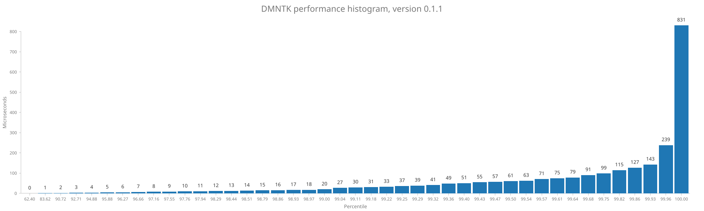

# DMNTK performance report

### Version v0.1.1

Total number of samples: **2814**

| Statistic |   Time |
|----------:|-------:|
|       Min |   0 µs |
|       Max | 831 µs |
|      Mean |   2 µs |
|    StdDev |  18 µs |

Percentage of samples executed in less than specified time

| Percentage |   Time | Samples |
|-----------:|-------:|:--------|
|      62.4% |   0 µs | 1756    |
|      83.6% |   1 µs | 2353    |
|      90.7% |   2 µs | 2553    |
|      92.7% |   3 µs | 2609    |
|      94.9% |   4 µs | 2670    |
|      95.9% |   5 µs | 2698    |
|      96.3% |   6 µs | 2709    |
|      96.7% |   7 µs | 2720    |
|      97.2% |   8 µs | 2734    |
|      97.5% |   9 µs | 2745    |
|      97.8% |  10 µs | 2751    |
|      97.9% |  11 µs | 2756    |
|      98.3% |  12 µs | 2766    |
|      98.4% |  13 µs | 2770    |
|      98.5% |  14 µs | 2772    |
|      98.8% |  15 µs | 2780    |
|      98.9% |  16 µs | 2782    |
|      98.9% |  17 µs | 2784    |
|      99.0% |  18 µs | 2785    |
|      99.0% |  20 µs | 2786    |
|      99.0% |  27 µs | 2787    |
|      99.1% |  30 µs | 2789    |
|      99.2% |  31 µs | 2791    |
|      99.2% |  33 µs | 2792    |
|      99.3% |  37 µs | 2793    |
|      99.3% |  39 µs | 2794    |
|      99.3% |  41 µs | 2795    |
|      99.4% |  49 µs | 2796    |
|      99.4% |  51 µs | 2797    |
|      99.4% |  55 µs | 2798    |
|      99.5% |  57 µs | 2799    |
|      99.5% |  61 µs | 2800    |
|      99.5% |  63 µs | 2801    |
|      99.6% |  71 µs | 2802    |
|      99.6% |  75 µs | 2803    |
|      99.6% |  79 µs | 2804    |
|      99.7% |  91 µs | 2805    |
|      99.8% |  99 µs | 2807    |
|      99.8% | 115 µs | 2809    |
|      99.9% | 127 µs | 2810    |
|      99.9% | 143 µs | 2812    |
|     100.0% | 239 µs | 2813    |
|     100.0% | 831 µs | 2814    |

